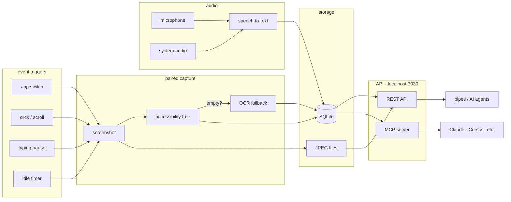
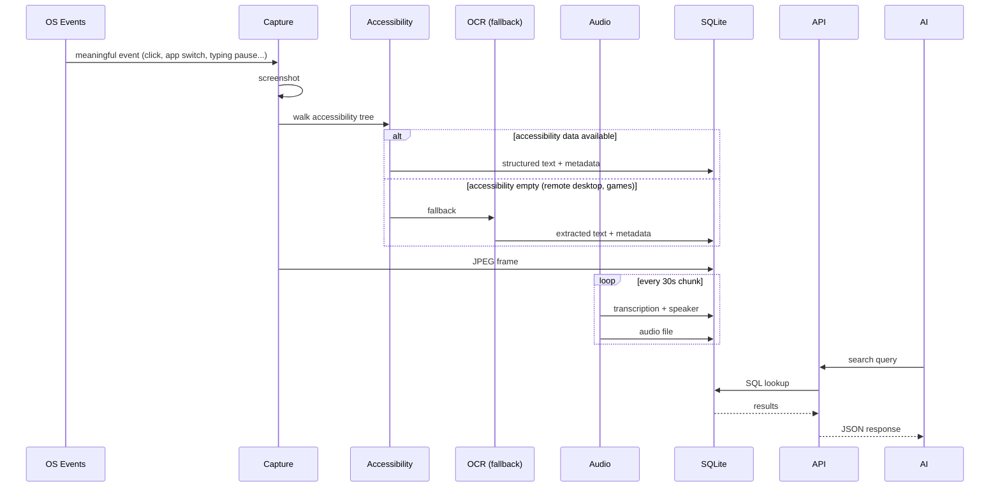
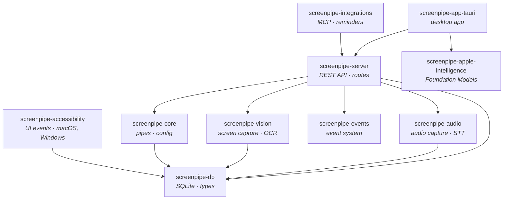
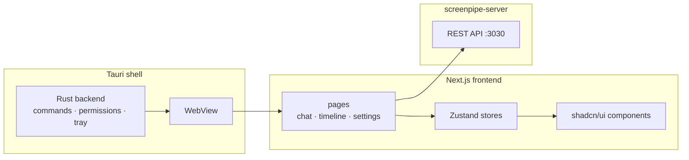

## overview

screenpipe is a Rust application that captures your screen and audio using an event-driven architecture, processes them locally, and stores everything in a SQLite database. instead of recording every second, it listens for meaningful OS events and captures only when something actually changes — pairing each screenshot with accessibility tree data for maximum quality at minimal cost.



## data flow



## crates

screenpipe is a Rust workspace with specialized crates:



## layers

### 1. event-driven capture

screenpipe listens for meaningful OS events instead of polling at a fixed FPS. when an event fires, it captures a screenshot and walks the accessibility tree together — same timestamp, same frame.

| trigger | description |
|---------|-------------|
| **app switch** | user switched to a different application |
| **window focus** | a new window gained focus |
| **click / scroll** | user interacted with the UI |
| **typing pause** | user stopped typing (debounced) |
| **clipboard copy** | content copied to clipboard |
| **idle fallback** | periodic capture every ~5s when nothing is happening |

| what | how | crate |
|------|-----|-------|
| **screen** | event-triggered screenshot of the active monitor | `screenpipe-vision` |
| **text extraction** | accessibility tree walk (structured text: buttons, labels, fields) | `screenpipe-accessibility` |
| **OCR fallback** | when accessibility data is empty (remote desktops, games, some Linux apps) | `screenpipe-vision` |
| **audio** | multiple input/output devices in configurable chunks (default 30s) | `screenpipe-audio` |

### 2. processing

| engine | type | platform | when used |
|--------|------|----------|-----------|
| accessibility tree | text extraction | macOS, Windows | primary — used for every capture |
| Apple Vision | OCR | macOS | fallback when accessibility is empty |
| Windows native | OCR | Windows | fallback when accessibility is empty |
| Tesseract | OCR | Linux | primary (accessibility support varies) |
| Whisper | speech-to-text | local, all platforms | audio transcription |
| Deepgram | speech-to-text | cloud API | optional cloud audio |

additional processing: speaker identification, PII redaction, frame deduplication (skips identical frames).

### 3. storage

all data stays local on your machine:

- **SQLite** at `~/.screenpipe/db.sqlite` — metadata, accessibility text, OCR text, transcriptions, speakers, tags, UI elements
- **media** at `~/.screenpipe/data/` — JPEG screenshots (event-driven frames), audio chunks

### 4. API

REST API on `localhost:3030`:

| endpoint | description |
|----------|-------------|
| `/search` | filtered content retrieval (OCR, audio, accessibility) |
| `/search/keyword` | keyword search with text positions |
| `/elements` | lightweight UI element search (accessibility tree data) |
| `/frames/{id}` | access captured frames |
| `/frames/{id}/context` | accessibility text + URLs + OCR fallback for a frame |
| `/health` | system status and metrics |
| `/raw_sql` | direct database queries |
| `/ai/chat/completions` | Apple Intelligence (macOS 26+) |

see [API reference](/cli-reference) for the full endpoint list.

### 5. pipes

[pipes](/pipes) are AI agents (`.md` prompt files) that run on your screen data. they're executed by an AI agent that reads the prompt, queries the screenpipe API, and takes action.

pipes live in `~/.screenpipe/pipes/{name}/` and run on cron-like schedules.

### 6. desktop app

the desktop app is built with **Tauri** (Rust backend) + **Next.js** (React frontend):



## database schema

key tables:

| table | stores |
|-------|--------|
| `frames` | captured screen frame metadata (includes `snapshot_path`, `accessibility_text`, `capture_trigger`) |
| `ocr_text` | OCR fallback text extracted from frames |
| `elements` | UI elements from accessibility tree (buttons, labels, text fields) with FTS5 search |
| `audio_chunks` | audio recording metadata |
| `audio_transcriptions` | text from audio |
| `speakers` | identified speakers |
| `ui_events` | keyboard, mouse, clipboard events |
| `tags` | user-applied tags on content |

inspect directly:

```bash
sqlite3 ~/.screenpipe/db.sqlite .schema
```

## resource usage

runs 24/7 on a MacBook Pro M3 (32 GB) or a $400 Windows laptop:

| metric | typical value |
|--------|---------------|
| RAM | ~600 MB |
| CPU | ~5-10% |
| storage | ~5-10 GB/month (event-driven capture only stores frames when something changes) |

## source code

| component | path |
|-----------|------|
| API server | [screenpipe-server/src/](https://github.com/screenpipe/screenpipe/tree/main/crates/screenpipe-server/src) |
| screen capture | [screenpipe-vision/src/core.rs](https://github.com/screenpipe/screenpipe/blob/main/crates/screenpipe-vision/src/core.rs) |
| audio capture | [screenpipe-audio/src/](https://github.com/screenpipe/screenpipe/tree/main/crates/screenpipe-audio/src) |
| database | [screenpipe-db/src/db.rs](https://github.com/screenpipe/screenpipe/blob/main/crates/screenpipe-db/src/db.rs) |
| pipes | [screenpipe-core/src/pipes/](https://github.com/screenpipe/screenpipe/tree/main/crates/screenpipe-core/src/pipes) |
| MCP server | [screenpipe-mcp/src/index.ts](https://github.com/screenpipe/screenpipe/blob/main/crates/screenpipe-integrations/screenpipe-mcp/src/index.ts) |
| desktop app | [screenpipe-app-tauri/](https://github.com/screenpipe/screenpipe/tree/main/apps/screenpipe-app-tauri) |
